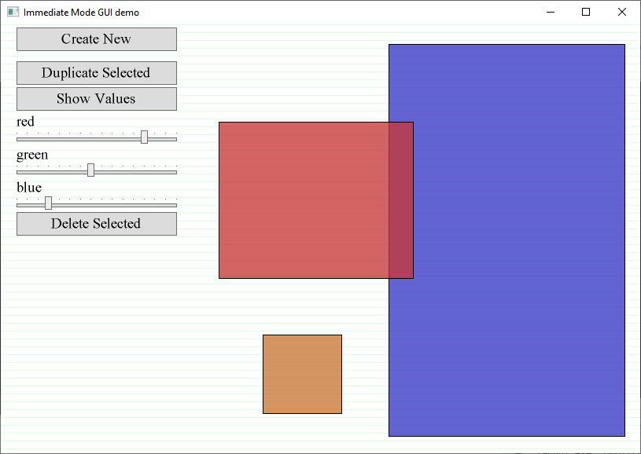

IMGUI DEMONSTRATION -- Sean Barrett, Aug 5 2005 -- Public Domain

This code is imported from [HERE](http://silverspaceship.com/inner/imgui/)!

Check out this video by Casey Muratori about imgui: https://www.youtube.com/watch?v=Z1qyvQsjK5Y

[Casey's IMGUI forum](http://web.archive.org/web/20070824203105/http://www.mollyrocket.com/forums/viewforum.php?f=10&sid=89c5695d80fb524c72fce0f82ba21008), and some noteworthy posts:

* "[I don't want to have to keep calling DoButton()!](http://web.archive.org/web/20070824203105/http://www.mollyrocket.com/forums/viewtopic.php?t=146&sid=89c5695d80fb524c72fce0f82ba21008)"
* [Atman's tree-view](http://web.archive.org/web/20070824203105/http://www.mollyrocket.com/forums/viewtopic.php?t=159&sid=89c5695d80fb524c72fce0f82ba21008)

OVERVIEW

This is a very simple sample application built on top of
a "one-pass" IMGUI implementation, in which every frame
every widget is called exactly once. This is only appropriate
for "real time" programs, like games, or if you don't mind
your editor eating 100% of CPU even when idle.

The sample application is a "rectangle editor". You can
move rectangles by dragging them, resize them by dragging
their edges and corners, and change their color using the
provided RGB sliders. Deselect by clicking on the background.
Obvious this is not a very interesting program in practice,
but it offers a straightforward demonstration.

The application demonstrates various UI features to show 
that they can be easily implemented in IMGUI:

 * overlapping widgets ('hot_to_be' detects top-most widget)
 * dynamic widget presence (based on selecting rectangles)
 * dynamic widget sizing (rescale to 1/4 width of screen)
 * dynamic widget configuration ('show values' button)
 * custom widgets (the rectangle editor is effectively one)
 * widget animation (the fade-in/out when hovering over)

SOURCE MANIFEST 

app.c        --  the IMGUI client application

ui.c         --  the IMGUI library

ui_event.c   --  remap from an event-driven system to
                 one-set-of-inputs-per-frame

gui_graph.c  --  interface for ui graphics calls; this file
                 remaps to "gr" lib below, but could turn it
                 into native windows calls or OpenGL, etc.

gr.c         -\
gr_extra.c   --  portable 32-bit graphics library
font_0.c     -/

winmain.c    --  all Windows-specific code; windows events
                 are re-dispatched as platform-independent
                 events to ui_event.c

laggui.dsp   --  MSVC6 project and workspace
laggui.dsw

IMPLEMENTATION NOTES

uiButtonLogic() is the most important function in the
entire system. It is used by buttons, sliders, and drag-handles
because it implements the basic functionality of "take control
on mouse-down, give up control on mouse-up".

It also returns True on mouse-up, the preferred behavior
for buttons. Sliders can still use uiButtonLogic(), because
they ignore the return value and simply check if they're
active to decide to allow changes to the slider value.

uiButtonLogicRect() implements an undrawn rectangular button;
unlike uiButtonLogic(), it actually compares the mouse to a button
shape. (uiButtonLogic() does not, so it could still be used for
things like rounded buttons, or even arbitrary shapes.)

uiLayout() is responsible for computing the appropriate place to
put each widget. It simply places the widget at the current cursor
location, and advances the cursor vertically. To do this, it must
know the height of the widget. Some widgets can automatically
determine a good width and height (for example, text buttons
will scale to fit the text inside), but usually you want to
override this (so that, e.g., all the fields in a menu are the
same width). The uiWidth() function specifies a width to use for
all later widgets; uiWidth1() specifies a width for the next
widget only. uiLayout() examines the uiWidth() state settings and
overrides the widget width/height at the same time it's updating
the cursor, so that individual widgets don't have to.

I wrote this library from scratch for this demonstration, hoping
to keep it simple enough to be decipherable, and correcting some
mistakes I made in My First IMGUI System.

So, (1) There are numerous bugs and misfeatures. For example, if
you allow sliders to autoscale their width, they will try to fit
their label. But if you turn on numeric display, the label can
change widths depending on the value, causing the scrollbar to
change widths as the value changes (causing a feedback loop
since scrollbar changes widths out from under the mouse pointer!).

(2) There's a dearth of widgets. No radio buttons, no scrollbars
and scrollable regions, no combo boxes, no menus. None of these
are hard to implement--I implemented them all in My First IMGUI
System. Here's some general strategy:

  * radio buttons are a collection of buttons with a state invariant
  * menus are a series of specially-drawn buttons with 0 spacing
  * combo-boxes are a button which, when clicked, toggles the combo
     box to its "live" state where it creates a (scrollable) menu
  * context menus and combo boxes should draw "on top". the way to
     do this is to push the screen "bitmap" and begin rendering into
     a temporary one, then draw that on top at the end. Similary, these
     should be forced on top even if they're called in the middle of the
     app, so to-be-hot needs some kind of "ignore everything after this,
     I'm absolutely on top"
  * scrollbars need to define a virtual screen coordinate system and
     offset mouse and display based on this, with an appropriate cliprect.
     then the scrollbar itself is slider-like and is used to position
     the virtual screen rect (this won't make use of hardware blitting,
     as Window's scrollbars do, but if we're redrawing the frame anyway,
     no big deal)
  * once you support scrollbars you may have lots of widgets offscreen;
     widgets should cull themselves ASAP and not do any complex processing.
     This may require you to override the normal layout code and force
     an explicit layout (use uiPos() to set the cursor coordinates)
